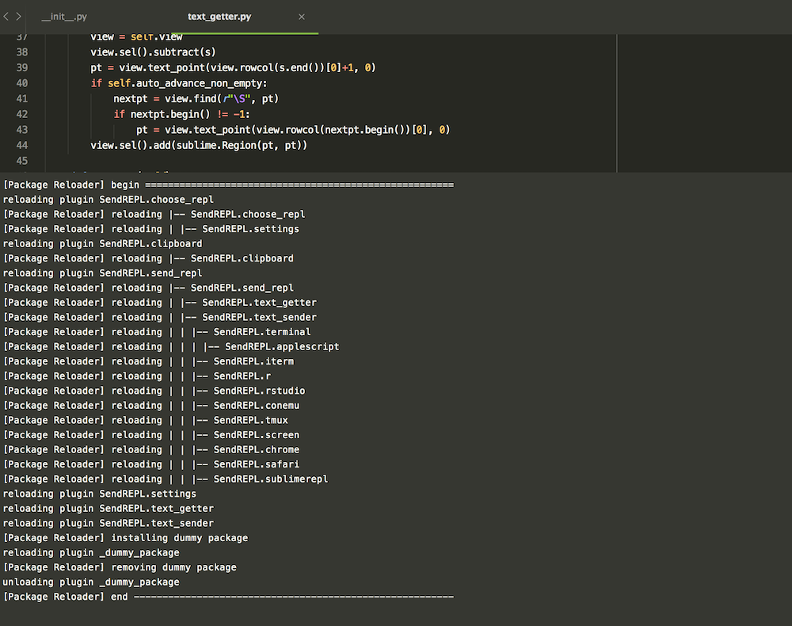

### ModuleReloader

Sublime Text package developers may find themselves have to close and re-open
ST multiple times when developing a package since ST doesn't reload all the
submodules of a package when the files are edited. This tiny package helps in
reloading the package without the need of reopening ST.

### Usage

To reload the package in the current window, use `Module Reloader: Reload`.

To activate reload on saving a `*py` file, use `Module Reloader: Toggle Reload On Save`.
ModuleReloader will guess the package name from the file path in order to remove the submodules
and to reload the package.

### Credits
This is derived from the [code](https://github.com/divmain/GitSavvy/blob/599ba3cdb539875568a96a53fafb033b01708a67/common/util/reload.py) of Eldar Abusalimov.
